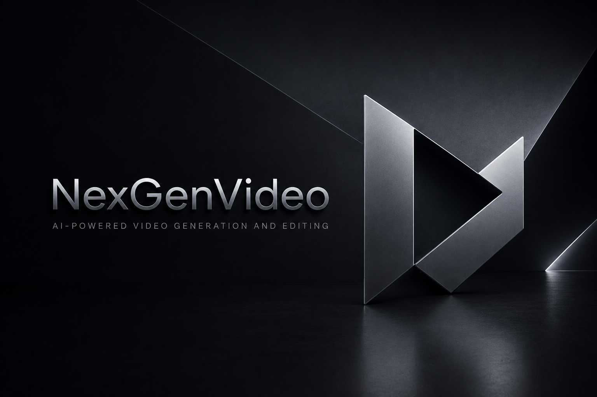

<div align="center">



# NexGen Video

**The video editor built for AI.**

<a href="https://github.com/iret77/nexgen-video/releases/download/dev-latest/NexGenVideo.dmg">
  
</a>

<sub><i>Requires macOS 26 (Tahoe) on Apple Silicon</i></sub>

<a href="https://discord.com/invite/SMVW6pKYmg"></a>

<p>
  <strong>English</strong> ·
  <a href="docs/readme/README.es.md">Español</a> ·
  <a href="docs/readme/README.zh-CN.md">简体中文</a> ·
  <a href="docs/readme/README.zh-TW.md">繁體中文</a> ·
  <a href="docs/readme/README.ja.md">日本語</a> ·
  <a href="docs/readme/README.ko.md">한국어</a> ·
  <a href="docs/readme/README.vi.md">Tiếng Việt</a> ·
  <a href="docs/readme/README.hi.md">हिन्दी</a> ·
  <a href="docs/readme/README.bn.md">বাংলা</a> ·
  <a href="docs/readme/README.ar.md">العربية</a> ·
  <a href="docs/readme/README.it.md">Italiano</a> ·
  <a href="docs/readme/README.pt-BR.md">Português (Brasil)</a> ·
  <a href="docs/readme/README.fr.md">Français</a> ·
  <a href="docs/readme/README.ru.md">Русский</a> ·
  <a href="docs/readme/README.tr.md">Türkçe</a>
</p>

</div>


---

NexGen Video is an open source video editor for Mac. You and your agent can generate and edit videos together inside the timeline.

### Swift-native video editor

We built NexGen Video from scratch with Swift. The north star is Premiere Pro, with our take on integrating AI into the workflow.

### Built-in Generative AI

Generate videos and images with SOTA models like Seedance, Kling, Nano Banana Pro inside the timeline editor.

### Integrates with your agents

Connects your Claude/Codex/Cursor via MCP, or use the in-app agent to work on the same project together.

## MCP server

When the app is open, it exposes an MCP server at `http://127.0.0.1:19789/mcp` via HTTP. To connect:

**Claude Code**
```bash
claude mcp add --transport http nexgen http://127.0.0.1:19789/mcp
```

**Codex**
```bash
codex mcp add nexgen --url http://127.0.0.1:19789/mcp
```

**Cursor**

The easiest way is go inside the app `Help` -> `MCP Instructions` -> `Install in Cursor`, or install manually by adding this to `~/.cursor/mcp.json`:

```
{
  "mcpServers": {
    "nexgen": {
      "type": "http",
      "url": "http://127.0.0.1:19789/mcp"
    }
  }
}
```

**Claude Desktop**

We bundle a [mcpb](https://github.com/modelcontextprotocol/mcpb) with the app that allows a one click install Desktop Extension on Claude Desktop. Go to `Help` -> `MCP Instructions` -> `Install in Claude Desktop`

## FAQ

**Is NexGen Video fully open source?**

Yes — the whole app is open source: editor, MCP server, and agent chat. Generation runs through third-party providers (fal.ai, Runway, …) that you connect with your own API keys; only those providers' models are external.

**Is it free?**

The editor is free. You can download it with no login required, and use it as a video editor like CapCut or Adobe Premiere. You can also use the MCP server for free, and start experimenting using Claude Code/Desktop or Cursor to interact with your timeline editor.

Generative AI features use your own provider API keys — no account or login.

**What platforms does it support?**

macOS 26 (Tahoe) on Apple Silicon only.

See [FAQ.md](FAQ.md) for more.

## Development

See [CONTRIBUTING.md](CONTRIBUTING.md)

## Community &amp; Support

- **Discord:** Join the community on **[Discord](https://discord.com/invite/SMVW6pKYmg)**.
- **Feedback &amp; Support:** Create a [Github Issue](https://github.com/iret77/nexgen-video/issues).

## Star History

<a href="https://www.star-history.com/?type=date&repos=iret77%2Fnexgen-video">
 <picture>
   <source media="(prefers-color-scheme: dark)" srcset="https://api.star-history.com/chart?repos=iret77/nexgen-video&type=date&theme=dark&legend=top-left" />
   <source media="(prefers-color-scheme: light)" srcset="https://api.star-history.com/chart?repos=iret77/nexgen-video&type=date&legend=top-left" />
   
 </picture>
</a>

## License

NexGen Video is a fork of Palmier Pro, open source under [GPLv3](LICENSE).

Copyright (C) 2026 Palmier, Inc. and the NexGen Video contributors.
